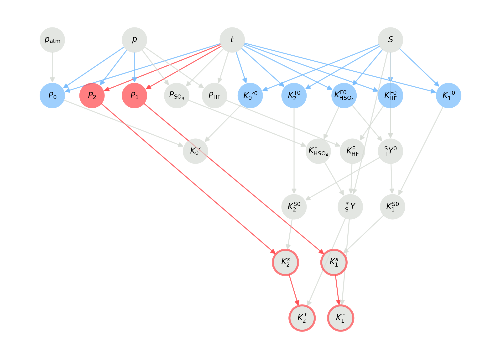

!!! danger "PyCO2SYS v2 beta"

    These are the docs for the beta release of PyCO2SYS v2!

    If you're here to test it, then thank you! and please report any issues via [the GitHub repo](https://github.com/mvdh7/PyCO2SYS/issues).

    **These instructions will not work for the current version 1.8** that can be installed through `pip` and `conda` - please see [PyCO2SYS.readthedocs.io](https://pyco2sys.readthedocs.io/en/latest/) for documentation for the latest stable release.

# Validity range checker

PyCO2SYS includes a tool to check whether arguments such as temperature, salinity and pressure fall within the valid ranges required by the parameterisations used internally to calculate equilibrium constants and other marine carbonate system properties.

Many of these validity ranges are poorly constrained or unknown, so the validity ranges will likely be updated in the future.

## Recording validity

The validity checker can be best thought of as a test of whether any values are definitely invalid; if no problems are flagged up, then that's not a guarantee that the value is valid.

```python
import PyCO2SYS as pyco2

co2s = pyco2.sys(t=[10, 20, 30], s=np.vstack([0, 35]))  # Set up a CO2System
co2s.check_valid(ignore=None, nan_invalid=False)
```

Once it's been checked, (in)validity is stored in the `valid` attribute of the `CO2System`.  This is much like the [`uncertainty`](uncertainty.md) attribute, i.e., a dict where keys can also be accessed with dot notation and using [shortcuts](advanced.md/#use-shortcuts).  For example:

```python
co2s.valid.total_borate
>>> [[1],
     [0]]

co2s.valid.pk_H2CO3
>>> [[2, 2, 2],
     [0, 0, 2]]
```

The values in these fields use an additive binary system, where

  * `0` = no reason to be invalid,
  * `1` = one or more of the arguments are out of their valid range,
  * `2` = one or more of the arguments were themselves invalid (inherited invalidity).

So where both `1` and `2` are true for a parameter, it will be assigned with a `3`.

In the example above, the first `total_borate` value is invalid because one of its inputs was out of the valid range.  The find this, check `valid.parts`:

```python
co2s.valid.parts.total_borate
```

This returns a dict containing a logical array for each argument to the `total_borate` function that has a defined valid range, in this case, only `salinity`.  The logical is `True` where the `salinity` values fall within the defined range, and `False` where they are invalid, either because they are out of range or because they have inherited invalidity from an earlier calculation step.

## Visualising validity

Once a `CO2System` has been created with `pyco2.sys`, it needs to be solved for whichever parameters are to be checked using the `solve` method, with `store_steps=2` in order for the validity visualisation to work properly.  Then, use the `plot_graph` method to view the results:

```python
co2s = pyco2.sys()
co2s.solve(store_steps=2)  # Solve for all parameters
co2s.plot_graph(mode="valid")
```

!!! warning "Appearance may change"

    The exact appearance of the validity graph generated by `plot_graph` may be adjusted in any future release.  The description below will be kept up-to-date for the currently released version of PyCO2SYS.

The output graph may look like the following:



Here, each parameter is represented by a circle.

The fill colour indicates the direct validity status of the parameter.  This means whether all of the arguments required to calculate the parameter fall within their valid ranges:

  * Blue: all arguments are in their valid ranges (e.g., $P_0$).
  * Red: at least one argument is outside its valid range (e.g., $P_1$ and $P_2$).
  * Grey: valid ranges not defined for this parameter (e.g., $p$, $t$ and $S$).
  
The arrow colours show exactly which parameters are inside (blue, e.g. $t$ for $P_0$) or outside (red, e.g. $t$ for $P_1$ and $P_2$) their valid ranges, or which do not (yet) have validity ranges specified (grey, e.g. $t$ for $P_\mathrm{HF}$).

If a parameter is invalid (e.g., $P_1$ and $P_2$), then all other parameters it is used to calculate are also considered indirectly invalid.  This is shown with red arrows and a red border around the indirectly invalid parameter (e.g. $K_1^*$ and $K_2^*$).
