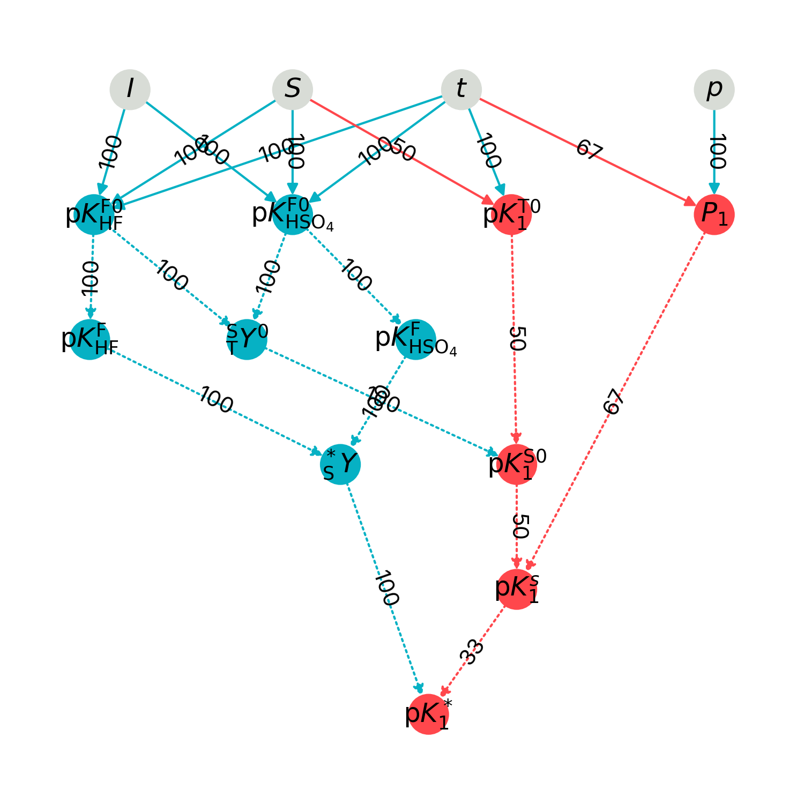

!!! danger "PyCO2SYS v2 beta"

    These are the docs for the beta release of PyCO2SYS v2!

    If you're here to test it, then thank you! and please report any issues via [the GitHub repo](https://github.com/mvdh7/PyCO2SYS/issues).

    **These instructions will not work for the current version 1.8** that can be installed through `pip` and `conda` - please see [PyCO2SYS.readthedocs.io](https://pyco2sys.readthedocs.io/en/latest/) for documentation for the latest stable release.

# Validity range checker

PyCO2SYS includes a tool to check whether arguments such as temperature, salinity and pressure fall within the valid ranges required by the parameterisations used internally to calculate equilibrium constants and other marine carbonate system properties.

Many of these validity ranges are poorly constrained or unknown, so the validity ranges will likely be updated in the future.

## Checking validity

The validity checker can be best thought of as a test of whether any values are definitely invalid; if no problems are flagged up, then that's not a guarantee that the value is valid.

```python
import numpy as np

co2s = pyco2.sys(t=[10, 20, 30], s=np.vstack([15, 35])).solve("pk1")
co2s.check_valid()
```

Once it's been checked, (in)validity is stored in the `valid` attribute of the `CO2System` (shortcut: `v`).  This is much like the [`uncertainty`](uncertainty.md) attribute, i.e., a dict where keys can also be accessed with dot notation and using [shortcuts](advanced.md/#use-shortcuts).  For example:

```python
co2s.valid.pk1  # True where pk1 is valid, False where it's invalid
```

A parameter can be invalid for two reasons:

  1. **Direct:** the parameter itself has defined validity ranges for its arguments, which the arguments have broken.
  2. **Indirect:** (at least) one of the arguments is itself invalid, either directly or indirectly.

To find out why a parameter is invalid, use the `why` method:

```python
why_pk1 = co2s.valid.why("pk1")
```

This returns a dict with the keys `direct` and `indirect`, containing the Boolean validity arrays for the arguments that affect the validity of the original parameter.  Using `why` iteratively on the parameters that appear in the `indirect` dict will eventually reveal the root causes of invalidity.

## Visualising validity

Once validity has been checked, the network graph for the relevant connections can be extracted for plotting:

```python
graph = co2s.v.get_graph()
```

A very basic network visualisation can be made using NetworkX:

```python
import networkx as nx

nx.draw_networkx(graph)
```

However, the default visualisation is not very easy to interpret.  Below is an example tidier figure, followed by the code used to generate it:



Above, whether all of the arguments required to calculate the parameter fall within their valid ranges:

  * Blue: all arguments are in their valid ranges (e.g., $\mathrm{p}K_\mathrm{HF}^\mathrm{F0}$).
  * Red: at least one argument is outside its valid range (e.g., $P_1$).
  * Grey: valid ranges not defined for this parameter (e.g., $S$).
  
The arrow colours show which parameters are inside (blue, e.g. $p$ for $P_1$) or (partially) outside (red, e.g. $t$ for $P_1$) their valid ranges.  The arrow style shows whether the validity is direct (solid) or indirect (dashed).

If a parameter is invalid (e.g., $P_1$), then all other parameters it is used to calculate are also considered indirectly invalid.  This is shown with red dashed arrows leading to child parameters (e.g., $\mathrm{p}K_1^*$).

The following code was used to generate the figure above.  Note that this also requires [PyGraphviz](https://pygraphviz.github.io/).

```python
from matplotlib import pyplot as plt

c_valid = "xkcd:turquoise blue"
c_invalid = "xkcd:light red"
fig, ax = plt.subplots(figsize=(5, 5))
pos = nx.nx_agraph.graphviz_layout(graph, prog="dot")
# Assign node colour based on valid or invalid
node_color = []
for n, attrs in graph.nodes.items():
    if "pct" in attrs:
        if attrs["pct"] < 100:
            node_color.append(c_invalid)
        else:
            node_color.append(c_valid)
    else:
        node_color.append("xkcd:light grey")
nx.draw_networkx_nodes(
    graph,
    ax=ax,
    pos=pos,
    node_color=node_color,
)
# Edge colour matches valid/invalid node colour,
# edge style shows direct (solid) vs indirect (dashed) (in)validity
nx.draw_networkx_edges(
    graph,
    ax=ax,
    pos=pos,
    edge_color=[
        c_invalid if graph.edges[e]["pct"] < 100 else c_valid
        for e in graph.edges
    ],
    style=[
        ":" if graph.edges[e]["type"] == "indirect" else "-"
        for e in graph.edges
    ],
)
# Edge labels indicate what percentage of the parameter values are valid
nx.draw_networkx_edge_labels(
    graph,
    ax=ax,
    pos=pos,
    edge_labels={
        e: str(np.round(graph.edges[e]["pct"]).astype(int))
        for e in graph.edges
    },
    bbox={"alpha": 0},
)
nx.draw_networkx_labels(
    graph, ax=ax, pos=pos, labels={n: pyco2.labels[n] for n in graph.nodes}
)
ax.axis("off")
fig.tight_layout()
```
